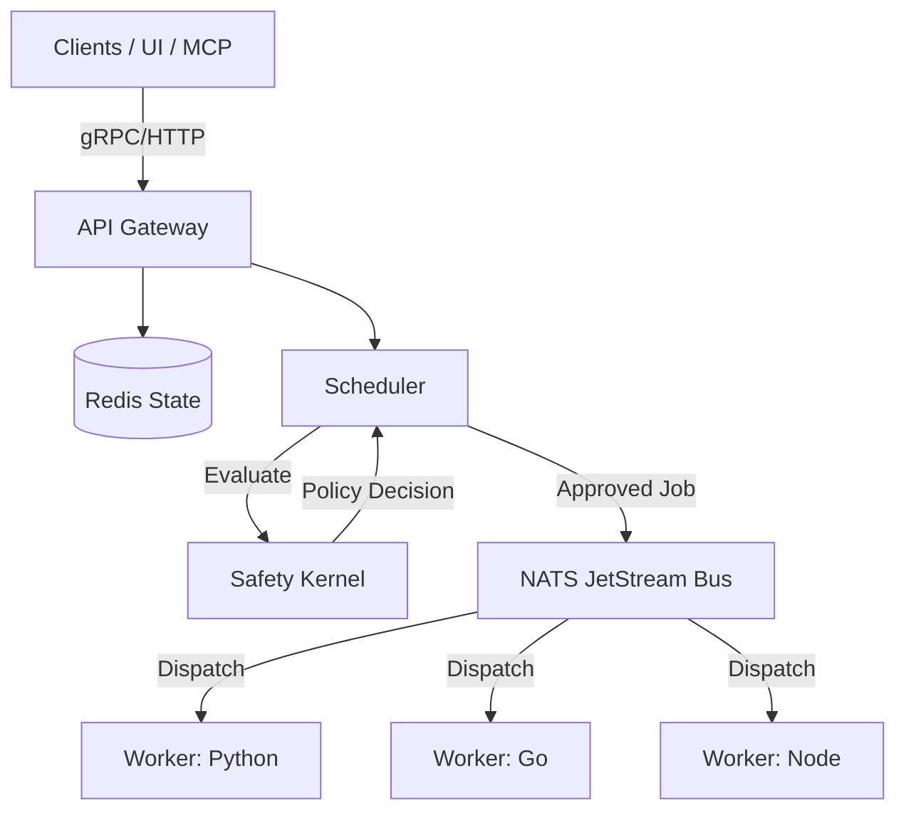

# Cordum - Deterministic Control Plane for Autonomous Workflows

[](./LICENSE)
[](https://github.com/cordum-io/cordum/releases)
[](./go.mod)
[](./docker-compose.yml)
[](./docs/README.md)


[](https://cordum.io)
[](https://cordum.io/docs)
[](https://discord.gg/26yw9VQV)

**Cordum** (cordum.io) is the governance-first control plane for autonomous AI agents.

It fills the "Trust Gap" between LLMs and production infrastructure. Instead of letting agents call tools directly, Cordum intercepts every intent, evaluates it against a **Safety Kernel**, and only dispatches approved commands to workers via a durable bus.

> **The Problem:** Enterprises can't let non-deterministic agents write to production.
> **The Solution:** Cordum enforces Policy-as-Code, deterministic scheduling, and durable execution to make agents safe for real work.

---

## ⚡️ 2-minute guardrails demo

See the **Safety Kernel** in action (Worker + Policy Gate + Approval).

Prereqs: the stack is running and the demo worker is online.

Terminal A (stack):
```bash
go run ./cmd/cordumctl up
# or: docker compose up -d
```

Terminal B (worker):
```bash
cd examples/demo-guardrails/worker
go run .
```

Terminal C (demo):
```bash
CORDUM_API_KEY=${CORDUM_API_KEY:-[REDACTED]} \
CORDUM_ORG_ID=${CORDUM_ORG_ID:-default} \
./tools/scripts/demo_guardrails.sh

```

Or use the one-command runner:

```bash
./tools/scripts/demo_guardrails_run.sh
```

View the walkthrough: [docs/demo-guardrails.md](./docs/demo-guardrails.md)

---

## 🚀 Getting started (1 minute)

Prereqs: Docker + Docker Compose. Go is optional unless you want `cordumctl`.

**Fastest path (recommended)**

```bash
./tools/scripts/quickstart.sh
```

**1. Install**

```bash
# Install via one-liner
curl -fsSL https://raw.githubusercontent.com/cordum-io/cordum/main/tools/scripts/install.sh | sh

# Safer: download, inspect, then run
curl -fsSL https://raw.githubusercontent.com/cordum-io/cordum/main/tools/scripts/install.sh -o install.sh
less install.sh
sh install.sh

# Or run locally from a clone:
./tools/scripts/install.sh

```

**2. Start the Platform**

```bash
# Requires Go
go run ./cmd/cordumctl up

# Or using Docker Compose
docker compose build && docker compose up -d

```

**3. Verify**

* **Dashboard:** Open `http://localhost:8082`
* **Smoke Test:** Run `CORDUM_API_KEY=${CORDUM_API_KEY:-[REDACTED]} ./tools/scripts/platform_smoke.sh`

---

## 🧠 Core Philosophy: "Policy-Before-Dispatch"

Most frameworks (LangChain, CrewAI) function by having the LLM directly call tools. **Cordum inverts this.**

* **Traditional:** `LLM` -> `Tool Execution` -> `Result`
* **Cordum:** `LLM` -> `Intent (Job)` -> `Safety Kernel` -> `Dispatch` -> `Worker`

This ensures that no matter how "jailbroken" or confused an LLM becomes, it cannot execute a dangerous command (e.g., `DROP DATABASE`) if the hard-coded policy forbids it.

### Show, Don't Tell: Policy as Code

You define strict boundaries for your agents using simple YAML policies.

```yaml
# policy/production-write.yaml
rules:
  - id: prevent-prod-destruction
    description: "Prevent agents from destructive actions in prod"
    trigger:
      tags: ["database", "write"]
      env: "production"
    action: DENY
    condition: "contains(payload.command, 'DROP') || contains(payload.command, 'DELETE')"

  - id: require-human-approval
    description: "Any payment over $50 requires human sign-off"
    trigger:
      tags: ["payment"]
    action: REQUIRE_APPROVAL

```

---

## 🏗 Architecture

Cordum is built as a distributed system using industry-standard infrastructure components. It is designed for **DevOps/Platform teams**, not just Python prototypers.




### The Stack

* **Control Plane (Go):** High-performance API Gateway, Scheduler, and Safety Kernel.
* **Data Plane (NATS JetStream):** Provides a durable nervous system. Ensures **at-least-once delivery**, so agent actions are never lost, even if a worker crashes.
* **State Store (Redis):** Holds workflow DAGs, payload pointers, and distributed locks.
* **Protocol (CAP v2):** The **Cordum Agent Protocol**. A language-agnostic wire contract (Protobuf) that standardizes how agents talk to the world.

### Comparison

| Feature | Standard Frameworks (LangChain/CrewAI) | Cordum Control Plane |
| --- | --- | --- |
| **Safety** | Prompt-based (System Prompts) | **Infrastructure-based (Policy Gate)** |
| **Execution** | Probabilistic & Direct | **Deterministic & Orchestrated** |
| **State** | Ephemeral / In-Memory | **Durable (Redis/NATS)** |
| **Role** | Application Prototyping | **Production Governance** |

---

## ✨ Feature Highlights

* **Universal Orchestrator:** Manage multi-step processes (DAGs) with retries, backoffs, delays, and crash-safe state.
* **Intelligent Scheduler:** Least-loaded scheduling with capability-aware pool routing (e.g., only route `requires: [gpu]` jobs to GPU nodes).
* **Pack System:** Install capabilities like "apps." A Pack bundles Workers, Workflows, and Policies into a single distributable overlay.
* **MCP Native:** Supports the **Model Context Protocol**. Use Cordum as the backend for Claude Desktop or IDE agents to add governance to your existing tools.
* **Flight Recorder:** Every decision, policy check, and output is recorded. Replay failed workflows from any step.

---

## 🛠 Developer Experience

* **`cordumctl`:** CLI for managing packs, inspecting runs, and handling artifacts.
* **Dashboard:** React-based UI for visualizing workflow graphs and managing approvals.
* **SDKs:**
* **Go:** First-class support (`sdk/`).
* **Polyglot:** Workers can be written in Python, Node, or Rust by implementing the CAP v2 protocol over NATS.


## 📦 Repositories

* `cordum`: Core control plane (this repo).
* `cordum-enterprise`: Enterprise binaries (Auth, RBAC, License check).
* `cordum-packs`: Official pack bundles + worker projects.
* `cap`: Protocol contracts and SDKs (`github.com/cordum-io/cap/v2`).

---

## 🏢 Enterprise

Enterprise features are delivered via the `cordum-enterprise` repo and require a license.

**Enterprise Capabilities:**

* **SSO/SAML Integration**
* **Multi-tenant RBAC & API Keys**
* **SIEM / Audit Log Export**
* **Dedicated Support & SLA**

[Contact Sales](https://cordum.io) for pricing and deployment assistance.

---

## 🤝 Contributing & License

**License:** [Business Source License 1.1 (BUSL-1.1)](LICENSE).

* Free for self-hosted and internal use.
* Proprietary for competing hosted/managed offerings.

**Resources:**

* [Documentation](./docs/README.md)
* [Contributing Guide](./CONTRIBUTING.md)
* [Security Policy](./SECURITY.md)
* [Support](./SUPPORT.md)
* [Governance](./GOVERNANCE.md)

```
