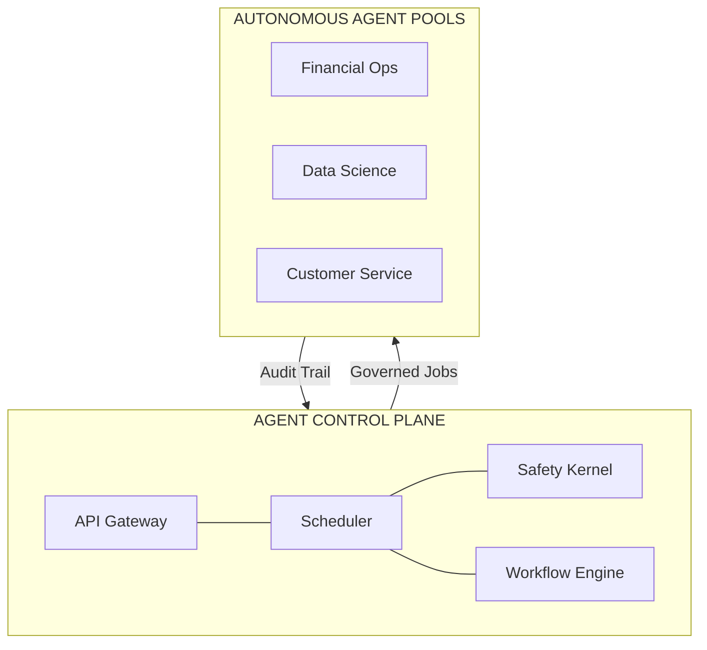
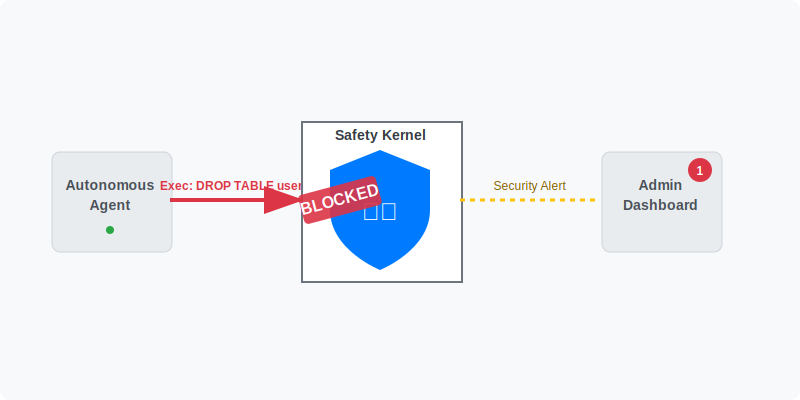
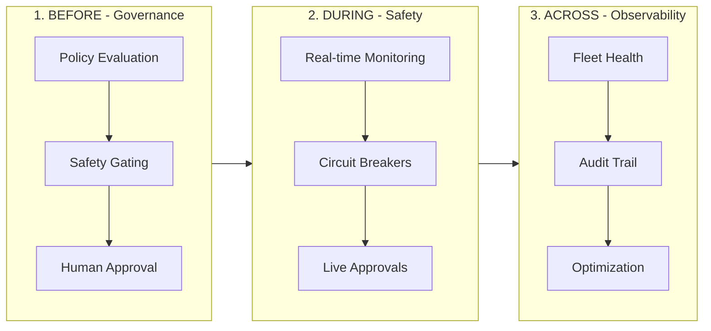
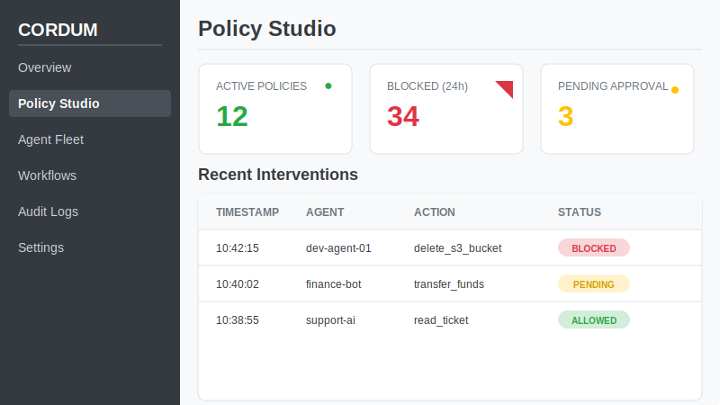

<p align="center">
  
</p>

<h1 align="center">Cordum</h1>

<p align="center">
  <strong>Know What Your AI Agents Are Doing. Before They Do It.</strong><br/>
  The Open Source <strong>Agent Control Plane</strong> for Governance, Safety, and Trust.
</p>

<p align="center">
  <a href="https://github.com/cordum-io/cordum/blob/main/LICENSE"></a>
  <a href="https://github.com/cordum-io/cordum/releases"></a>
  <a href="https://discord.gg/U4NpXtjP"></a>
  <a href="https://github.com/cordum-io/cap"></a>
</p>

---

## The Problem: The Agent Risk Gap

Enterprises are rushing to deploy **Autonomous AI Agents**, but they're hitting a wall of risk. According to Gartner, **74% of enterprises see AI agents as a new attack vector**, and over 40% of agentic AI projects will be canceled due to inadequate risk controls.

The current landscape leaves teams with a choice:
1. **Restrict agents** to simple, low-value read-only tasks.
2. **Accept the risk** of autonomous agents taking destructive, unmonitored actions.

Without a dedicated governance layer, you're flying blind:
- **No visibility**: You don't know what your agents are doing until *after* they do it.
- **No safety rails**: There's no way to intercept dangerous operations before they execute.
- **No human-in-the-loop**: Sensitive actions happen without manual oversight.
- **No audit trail**: When things go wrong, you can't reconstruct the chain of thought.

## The Solution: Cordum Agent Control Plane

Cordum is an **Agent Control Plane** that provides a deterministic governance layer for probabilistic AI minds. It allows you to define, enforce, and audit the behavior of your **Autonomous AI Agents** across any framework or model.



<!-- Replace with a high-impact GIF showing a risky agent action being caught by Cordum -->


### Governance Across the Lifecycle

Cordum's **Before/During/Across** framework provides exhaustive control over your agent operations:



- **BEFORE (Governance)**: Define declarative policies that evaluate job requests *before* an agent executes. Trigger safety kernel checks, throttle risky actions, or flag operations for human approval.
- **DURING (Safety)**: Real-time visibility into active agent runs. Monitor progress, handle step-level approvals, and enforce timeouts or circuit breakers on the fly.
- **ACROSS (Observability)**: Manage your entire fleet from a single control plane. Aggregate audit trails, track capability-based routing, and observe agent pool health in real-time.

## Quickstart

**Prerequisites:** Docker, Docker Compose, Go 1.24+

```bash
# Clone the repo
git clone https://github.com/cordum-io/cordum.git
cd cordum

# Set an API key
export CORDUM_API_KEY="$(openssl rand -hex 32)"

# Start everything (auto-generates TLS certs on first run)
go run ./cmd/cordumctl up

# Open dashboard
open http://localhost:8082
```

Or use the quickstart script:

```bash
export CORDUM_API_KEY="$(openssl rand -hex 32)"
./tools/scripts/quickstart.sh
```

That's it. You have a running Cordum instance with API, scheduler, safety kernel, dashboard, and TLS enabled by default. System configuration is auto-bootstrapped on first startup.

## Key Features

<!-- Replace with a visual showing the Policy Studio and Safety Kernel in action -->


| Governance Feature | Why It Matters for Enterprise |
|--------------------|--------------------------------|
| **Safety Gating** | Prevents agents from executing destructive or unauthorized actions *before* they occur. |
| **Output Quarantine** | Automatically blocks PII leaks, secrets, or hallucinated results from reaching the client. |
| **Human-in-the-Loop** | Mandates human oversight for high-risk operations (e.g., financial transfers, prod access). |
| **Pool Segmentation** | Ensures sensitive data only reaches agents in trusted environments. |
| **Deterministic Audit** | Prove exactly *why* a decision was made with a full chain-of-thought audit trail. |
| **Governance Policies** | Declarative YAML-based rules that map enterprise risk to agent behavior. |
| **Policy Simulator** | Test your governance rules against historical data before rolling them out to production. |

## Architecture

```
cordum/
├── cmd/                          # Service entrypoints + CLI
│   ├── cordum-api-gateway/       # API gateway (HTTP/WS + gRPC)
│   ├── cordum-scheduler/         # Scheduler + safety gating
│   ├── cordum-safety-kernel/     # Policy evaluation
│   ├── cordum-workflow-engine/   # Workflow orchestration
│   ├── cordum-context-engine/    # Optional context/memory service
│   └── cordumctl/                # CLI
├── core/                         # Core libraries
│   ├── controlplane/             # Gateway, scheduler, safety kernel
│   ├── context/                  # Context engine implementation
│   ├── infra/                    # Config, storage, bus, metrics
│   ├── protocol/                 # API protos + CAP aliases
│   └── workflow/                 # Workflow engine
├── dashboard/                    # React UI
├── sdk/                          # SDK + worker runtime
├── cordum-helm/                  # Helm chart
├── deploy/k8s/                   # Kubernetes manifests
└── docs/                         # Documentation
```

## Documentation

| Doc | Description |
|-----|-------------|
| [System Overview](docs/system_overview.md) | Architecture and data flow |
| [Core Reference](docs/CORE.md) | Deep technical details |
| [Docker Guide](docs/DOCKER.md) | Running with Compose |
| [Agent Protocol](docs/AGENT_PROTOCOL.md) | CAP bus + pointer semantics |
| [MCP Server](docs/mcp-server.md) | MCP stdio + HTTP/SSE integration |
| [Pack Format](docs/pack.md) | How to package agent capabilities |
| [Local E2E](docs/LOCAL_E2E.md) | Full local walkthrough |

## Protocol: CAP — The Open Standard for Agent Governance

Cordum implements [CAP (Cordum Agent Protocol)](https://github.com/cordum-io/cap), an open protocol specifically designed for distributed AI agent governance. CAP provides a unified interface for defining agent capabilities, submitting jobs, and enforcing safety policies across heterogeneous agent pools.

### CAP vs. MCP: Why You Need Both

While both are essential, they solve different parts of the agent stack:

| Protocol | Focus | Level | Responsibility |
|----------|-------|-------|----------------|
| **MCP** (Model Context Protocol) | **Tool Calling** | Local | How a model interacts with a tool. |
| **CAP** (Cordum Agent Protocol) | **Governance** | Network | How an agent is governed within an enterprise. |

- **MCP** is for *within* the agent — it defines how a model calls local tools.
- **CAP** is for *above* the agent — it defines the governance control plane for the entire agent fleet.

Use CAP for high-level orchestration and safety gating, and MCP inside your agents for fine-grained tool integration.

[Read the full deep dive: MCP vs CAP: Why Your AI Agents Need Both Protocols](https://dev.to/yaron_torgeman_104570d968/-mcp-vs-cap-why-your-ai-agents-need-both-protocols-3g4l)

## MCP Server

Cordum includes an MCP server framework with:

- **Standalone stdio mode** via `cmd/cordum-mcp` (for Claude Desktop/Code local integration)
- **Gateway HTTP/SSE mode** via `/mcp/message` and `/mcp/sse` (when `mcp.enabled=true`)

See [docs/mcp-server.md](docs/mcp-server.md) for setup, auth headers, and client configuration examples.

## SDK

The Go SDK makes it easy to build CAP-compatible workers:

```go
import (
    "log"

    "github.com/cordum/cordum/sdk/runtime"
)

type Input struct {
    Prompt string `json:"prompt"`
}

type Output struct {
    Summary string `json:"summary"`
}

func main() {
    agent := &runtime.Agent{Retries: 2}

    runtime.Register(agent, "job.summarize", func(ctx runtime.Context, input Input) (Output, error) {
        // Your agent logic here
        return Output{Summary: input.Prompt}, nil
    })

    if err := agent.Start(); err != nil {
        log.Fatal(err)
    }
    select {}
}
```

SDKs: **Go** (stable) | [**Python**](https://github.com/cordum-io/cap) | [**Node**](https://github.com/cordum-io/cap)

## Community

- **Discord:** [Join the conversation](https://discord.gg/HGGHbU26)
- **GitHub Discussions:** [Ask questions](https://github.com/cordum-io/cordum/discussions)
- **Twitter/X:** [@coraboratedai](https://x.com/Cordum_io)
- **Email:** [admin@cordum.io](mailto:admin@cordum.io)

## Enterprise

Cordum Enterprise adds:
- SSO/SAML integration
- Advanced RBAC
- SIEM export
- Priority support

[Contact us](mailto:admin@cordum.io) for pricing.

## Governance

Cordum follows a transparent governance model with a protocol stability pledge, maintainer structure, and clear decision-making process. See [GOVERNANCE.md](GOVERNANCE.md) for details including:

- **Protocol Stability**: CAP v2 wire format frozen until February 2027
- **Security**: [SECURITY.md](SECURITY.md) for vulnerability reporting
- **Versioning**: Semantic versioning with deprecation policy

## Roadmap

See [ROADMAP.md](ROADMAP.md) for the full feature roadmap, completed milestones, and planned work.

## Changelog

See [CHANGELOG.md](CHANGELOG.md) for a detailed log of all changes by version.

## Contributing

We welcome contributions! See [CONTRIBUTING.md](CONTRIBUTING.md) for guidelines.

## License

Licensed under [Business Source License 1.1 (BUSL-1.1)](LICENSE). 

Free for self-hosted and internal use. Not permitted for competing hosted/managed offerings. See LICENSE for details and Change Date.

---

<p align="center">
  <strong>Ready to govern your AI agents?</strong><br/>
  <a href="https://cordum.io">cordum.io</a> · <a href="https://github.com/cordum-io/cap">CAP Protocol</a> · <a href="https://discord.gg/U4NpXtjP">Discord</a>
</p>

<p align="center">
  ⭐ Star this repo if Cordum helps you deploy agents safely
</p>
