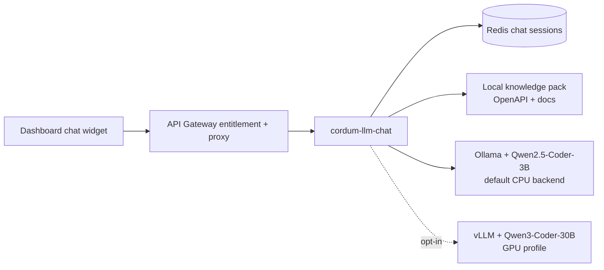

# Cordum LLM Chat Assistant

The Cordum chat assistant is an **informational-only**, self-hosted Q&A helper. It answers operator questions about Cordum concepts, API endpoints, workflow configuration, approval gates, policies, audit behavior, and troubleshooting from the local knowledge pack.

It does **not** call MCP tools, submit jobs, approve or reject work, trigger workflows, or mutate Cordum state. When a user asks for a state change, the assistant explains the dashboard, CLI, or API path the operator should use.

## Default backend

Production defaults to local Ollama with Qwen2.5-Coder-3B:

- `LLMCHAT_OPS_BACKEND=ollama-cpu`
- `LLMCHAT_BASE_URL=http://ollama:11434/v1`
- `LLMCHAT_MODEL=qwen2.5-coder:3b-instruct-q4_K_M-ctx32k` in Compose/Helm packaging

This runs on CPU-only Docker/Kubernetes hosts with 4 GB+ RAM and performs no external egress.

## Opt-in vLLM backend

GPU customers who want the larger Qwen3-Coder-30B model can opt in explicitly:

- Compose: `docker compose --profile gpu up -d` plus `LLMCHAT_OPS_BACKEND=vllm-gpu`, `LLMCHAT_BASE_URL=http://qwen-inference:8000/v1`, `LLMCHAT_MODEL=qwen3-coder`
- Helm: `--set inference.backend=vllm-gpu`

The vLLM path remains local/self-hosted and keeps the pinned v0.16.0 image plus ClusterIP/loopback-only exposure boundaries.

## Security model

- **License gate:** every chat endpoint is gated by the `LLMChatAssistant` entitlement.
- **Trusted-forwarder boundary:** browser traffic goes through the gateway; direct `cordum-llm-chat` routes require the service API key forwarded by the gateway.
- **Local knowledge only:** OpenAPI and docs content are mounted or packaged locally. The assistant does not retrieve internet content at runtime.
- **Secret handling:** knowledge content and assistant context are redacted before insertion when redactor hooks are available; prompts and logs must not expose API keys, JWTs, kubeconfigs, private keys, or certificates.
- **Session storage:** chat sessions are stored in Redis under `chat:session:{id}` with a sliding TTL.

## Key references

- [Knowledge pack ingestion](knowledge-pack.md)
- [Helm + Compose deployment](helm.md)
- [Provider configuration](provider-config.md)
- [Ollama runtime](ollama-runtime.md)
- [Production readiness runbook](production-readiness.md)
- [Hardware tiers / opt-in vLLM](hardware-tiers.md)
- [Troubleshooting](troubleshooting.md)
